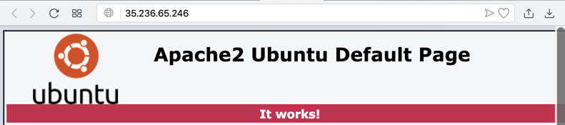
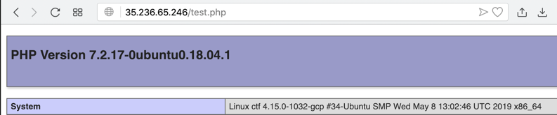

# lamectf
A very simple CTF scoring engine

<h1>Using this Scoring Engine</h1>

<h2>What You Need</h2>
<ul>
<li>A Linux cloud server machine
<li>Some questions and answers for students
</ul>

<h2>Purpose</h2>

To easily create CTF-style gamified learning contests.
This system is designed to be simple and easy to set up.
It is probably not very secure--if you hack it, 
please let me know!

<h1>Task 1: Makng a Web Server</h1>

<h2>Installing Apache and PHP</h2>

You need Apache and PHP.  
<pL>
On Ubuntu 18.04, these commands work:

<code>
sudo apt update</code>
 
<code>
sudo apt install apache2 php libapache2-mod-php -y
</code>

<h2>Testing Apache</h2>

Open your server's IP address in a Web browser.
You should see the default Apache page,
as shown below.

<h2>Testing PHP</h2>

Execute this comman to make a simple PHP
test file:
<code>
echo "&lt;?php phpinfo() ?&gt;" | sudo tee /var/www/html/test.php
</code>

Open your server's IP address followed by "<b>/test.php</b>"
in a Web browser.
You should see a PHP info page,
as shown below.

<h2>Task 2: Installing the CTF Engine</h2>

In a Terminal, execute these commands:

<code>sudo apt install git -y</code> 
<code>cd /var/www/html</code> 
<code>sudo git clone https://github.com/sambowne/lamectf.git</code> 
<code>sudo bash lamectf/setup.sh</code>

Open your server's IP address 
in a Web browser.  You should see the demonstration
CTF.

Customize the <b>answers.php</b> file to use it.

